CDH 6.2.0 安装
=====
[Download CDH 6.2.0](https://www.cloudera.com/downloads/cdh/6-2-0.html) | 
[Detailed CDH 6 Installation Guide](https://www.cloudera.com/content/www/en-us/documentation/enterprise/6/6.2/topics/installation.html#install_cm_cdh)

常见的 JDK 有 Oracle JDK、和 Open JDK，而常用到的 Open JDK有 Linux yum 原版的 Open JDK、Zulu JDK、GraalVM CE JDK。

安装 CDH 环境的 JDK 时还是**建议先使用官方提供的下载资源列表里的 [oracle-j2sdk1.8-1.8.0+update181-1.x86_64.rpm](https://archive.cloudera.com/cm6/6.2.0/redhat7/yum/RPMS/x86_64/oracle-j2sdk1.8-1.8.0+update181-1.x86_64.rpm)
Oracle JDK 安装，等CDH安装完毕，需要的组建服务安装配置完成之后，再升级为自己需公司要求的 Open JDK，且强烈建议这样做**。

对于包中个组建版本可查看 [CDH 6.2.0 Packaging](https://www.cloudera.com/documentation/enterprise/6/release-notes/topics/rg_cdh_62_packaging.html)，
或者镜像库中查看 [noarch](https://archive.cloudera.com/cdh6/6.2.0/redhat7/yum/RPMS/noarch/) | [x86_64](https://archive.cloudera.com/cdh6/6.2.0/redhat7/yum/RPMS/x86_64/) 。

<br/>

# 目录
* 1 环境准备
	+ 1.1 如果环境不是新的，先清除不需要的服务
	+ 1.2 Apache HTTP 服务安装
		- Step 1：先查Apache http服务状态
		- Step 2：安装 Apache http服
		- Step 3：修改 Apache http 配置
		- Step 4：创建资源路径
	+ 1.3 Host 配置
	+ 1.4 剩下
	+ 1.5 其他
* 2 下载资源
	+ 2.1 简版下载
		- 2.1.1 下载 parcel 包
		- 2.1.2 下载需要的rpm包
		- 2.1.3 获取 cloudera-manager 其他资源
			* 2.1.3.1 获取`cloudera-manager.repo`
			* 2.1.3.2 初始化`repodata`
		- 2.1.4 下载数据库驱动
	+ *2.2 完整版下载
		- 2.2.1 下载 parcel files
		- 2.2.2 下载 Cloudera Manager 
		- 2.2.3 下载数据库驱动
	+ 2.3 设置安装节点的 cloudera-manager yum信息
		- 2.3.1 下载
		- 2.3.2 修改
		- 2.3.3 更新yum
	+ 2.4 设置Cloudera Manager驱动
* 3 安装
	+ 3.1 安装 Cloudera Manager
	+ 3.2 设置 Cloudera Manager 数据库
		- 3.2.1 创建 Cloudera 软件对应的数据库
		- 3.2.2 初始化数据库
	+ 3.3 安装CDH和其他软件
		- 3.3.1 启动Cloudera Manager Server
		- 3.3.2 转到 Web 浏览器
			* 集群安装
			* 使用向导设置群集
* 4 其他问题
	+ 4.1 Error starting NodeManager
	+ 4.2 Could not open file in log_dir /var/log/catalogd: Permission denied
	+ 4.3 Cannot connect to port 2049
	+ 4.4 Kafka不能创建Topic
	+ 4.5 安装Hive组件异常
	+ 4.6 Impala时区问题设置
	+ 4.7 hdfs用户登录不上
	+ 4.8 NTP问题
	+ 4.9 安装组件的其他异常
	
* PO一张最后安装完成的CDH Web 页面
* 最后

* * * *

<br/>


# 1. 环境准备
这里是CDH对环境的要求：[Cloudera Enterprise 6 Requirements and Supported Versions](https://www.cloudera.com/documentation/enterprise/6/release-notes/topics/rg_requirements_supported_versions.html#cm_cdh_compatibility)

## 1.1 如果环境不是新的，先清除不需要的服务
假设旧环境已经安装过CDH或HDP或者其它，需要清除这些，清除相对麻烦些，删除的时候需谨慎。但整体可以这样快速清除
* 1 获取root用户
* 2 卸除通过rmp安装的服务：
    ```bash
    rpm -qa 
    # 或者指定某些服务
    rpm -qa 'cloudera-manager-*'
    
    # 移除服务
    rpm -e 上面命令查到的名字 --nodeps
    
    # 清除yum 缓存
    sudo yum clean all
    ```
* 3 查看进程:`ps -aux > ps.txt`，通过第一列`USER` 和 最后一列`COMMAND` 确定是否为清除的进程，如果是根据第二列`PID` kill掉：`kill -9 pid号` 
* 4 查看系统的用户信息：` cat /etc/passwd `
* 5 删除多余的用户：` userdel 用户名 `
* 6 搜索这个用户相关的的文件，并删除： 
    ```bash
     find / -name 用户名*
     # 删除查到的文件
     rm -rf 文件
    ```
* 7 在删除时有时可能文件被占用，可以先通过 `lsof` 命令找到被占用的进程，关闭后再删除。
* 8 虽然查不到进程被占用，可能文件被挂载了，卸除后再删除: `umount cm-5.16.1/run/cloudera-scm-agent/process`，
然后再：`rm -rf cm-5.16.1/`。当卸除命令执行后还是不能删除时，可以多运行几次，再尝试删除文件。


## 1.2 Apache HTTP 服务安装
因为有些服务器对访问外网有严格限制时，可以配置一个 HTTP服务，将下载的资源上传上去，方便后面的安装。

### Step 1：先查Apache http服务状态
如果状态可查到，只需要修改配置文件(查看Step 3)，重启服务就行。如果状态查询失败，需要先安装 `Apache HTTP` 服务(接着Step 2)。
```bash
sudo systemctl start httpd
```

### Step 2：安装 Apache http服
```bash
 yum -y install httpd
```

### Step 3：修改 Apache http 配置
配置如下内容。最后保存退出。
可以查看到配置的文档路径为：`/var/www/html`。其他的配置项可以默认，也可以根据情况修改。
```bash
vim /etc/httpd/conf/httpd.conf
 
 # 大概在 119 行
DocumentRoot "/var/www/html"

# 大概在 131 行，<Directory "/var/www/html"> </Directory>标签内对索引目录样式设置
# http://httpd.apache.org/docs/2.4/en/mod/mod_autoindex.html#indexoptions
# 最多显示100个字符，utf-8字符集，开启目录浏览修饰，目录优先排序
IndexOptions NameWidth=100 Charset=UTF-8 FancyIndexing FoldersFirst
```
配置完后，记得重启服务。

### Step 4：创建资源路径
```bash
sudo mkdir -p /var/www/html/cloudera-repos
```

## 1.3 Host 配置
将集群的Host的ip和域名配置到每台机器的`/etc/hosts`，同时，
**注意** 一定保证 每个机器有 hostname loopback address。


## 1.4 剩下
这部分安装我们都比较熟悉，可以自行先将这些先安装完成。下面以 Centos 7.4 为例安装 CDH 6.2.0 。
* [配置网络名称](https://www.cloudera.com/documentation/enterprise/6/6.2/topics/configure_network_names.html)
* [关闭防火墙](https://www.cloudera.com/documentation/enterprise/6/6.2/topics/install_cdh_disable_iptables.html)
* [设置 SELinux mode](https://www.cloudera.com/documentation/enterprise/6/6.2/topics/install_cdh_disable_selinux.html)
* [启用NTP服务](https://www.cloudera.com/documentation/enterprise/6/6.2/topics/install_cdh_enable_ntp.html)。时区可以都设置为 `timedatectl set-timezone Asia/Shanghai`。设置完毕后可以查看同步状态：`ntpq -p`
* 安装一个元数据，比如 [PostgreSQL](https://www.cloudera.com/documentation/enterprise/6/6.2/topics/cm_ig_extrnl_pstgrs.html#cmig_topic_5_6)，
[MariaDB](https://www.cloudera.com/documentation/enterprise/6/6.2/topics/install_cm_mariadb.html#install_cm_mariadb)，
[MySQL](https://www.cloudera.com/documentation/enterprise/6/6.2/topics/cm_ig_mysql.html#cmig_topic_5_5)或
[Oracle](https://www.cloudera.com/documentation/enterprise/6/6.2/topics/cm_ig_oracle.html#cmig_topic_5_8)数据库，这里可以选用 Mysql。

**注意** Mysql的配置文件`/etc/my.cnf`请参考[Configuring and Starting the MySQL Server](https://www.cloudera.com/documentation/enterprise/6/6.2/topics/cm_ig_mysql.html#cmig_topic_5_5_2)，进行配置。


## 1.5 其他
其他更详细的可以阅读CDH官方文档：
* [Cloudera Manager和Cloudera Navigator使用的端口](https://www.cloudera.com/documentation/enterprise/6/6.2/topics/cm_ig_ports_cm.html)
* [CDH集群主机和角色分配](https://www.cloudera.com/documentation/enterprise/6/6.2/topics/cm_ig_host_allocations.html#concept_xy5_m4y_dw)。官方针对不同规模的集群有一些推荐的角色分配。
* [CDH中组建使用的端口](https://www.cloudera.com/documentation/enterprise/6/6.2/topics/cdh_ports.html)
* [Cloudera Manager中的服务依赖项](https://www.cloudera.com/documentation/enterprise/6/6.2/topics/cm_ig_service_dependencies.html)

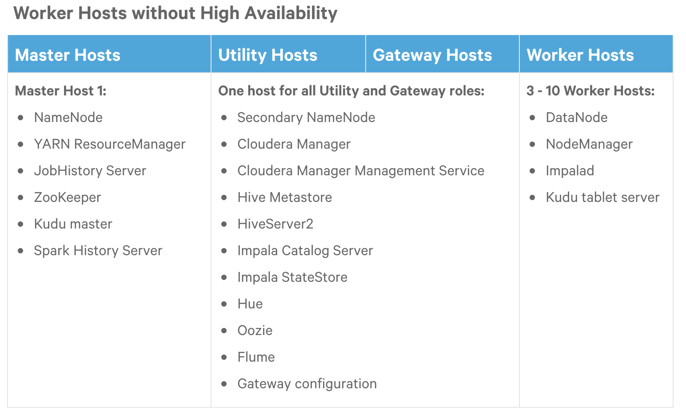


# 2. 下载资源
如果服务器无法下载，对步骤`2.1`和`2.2`可以在本地将如下资源下载后上传到`Apache HTTP` 服务器上的目录：`/var/www/html/cloudera-repos`。

这里分享两种方式，一种是最简版，一种是完全版，服务器上的资源库都可以使用这个，`2.1`和`2.2`**选择一种方式下载**即可。
推荐第一种方式，直下载需要的包，下载的资源少，下载速度快，安装比较快，后期parcel或者cdh组建升级，可以下载对应的包再在web页面配置资源库，进行升级。

## 2.1 简版下载
其中将下载资源上传到搭建的 Apache HTTP 服务节点，这里不再赘述是默认您已将文件夹创建。

### 2.1.1 下载 parcel 包
```bash
 wget -b https://archive.cloudera.com/cdh6/6.2.0/parcels/CDH-6.2.0-1.cdh6.2.0.p0.967373-el7.parcel			
 wget https://archive.cloudera.com/cdh6/6.2.0/parcels/CDH-6.2.0-1.cdh6.2.0.p0.967373-el7.parcel.sha1		
 wget https://archive.cloudera.com/cdh6/6.2.0/parcels/manifest.json
```
将下载的包上传到 `/var/www/html/cloudera-repos/cdh6/6.2.0/parcels`

### 2.1.2 下载需要的rpm包
```bash
 wget https://archive.cloudera.com/cm6/6.2.0/redhat7/yum/RPMS/x86_64/cloudera-manager-agent-6.2.0-968826.el7.x86_64.rpm
 wget -b https://archive.cloudera.com/cm6/6.2.0/redhat7/yum/RPMS/x86_64/cloudera-manager-daemons-6.2.0-968826.el7.x86_64.rpm
 wget https://archive.cloudera.com/cm6/6.2.0/redhat7/yum/RPMS/x86_64/cloudera-manager-server-6.2.0-968826.el7.x86_64.rpm
 wget https://archive.cloudera.com/cm6/6.2.0/redhat7/yum/RPMS/x86_64/cloudera-manager-server-db-2-6.2.0-968826.el7.x86_64.rpm
 wget https://archive.cloudera.com/cm6/6.2.0/redhat7/yum/RPMS/x86_64/enterprise-debuginfo-6.2.0-968826.el7.x86_64.rpm
 wget https://archive.cloudera.com/cm6/6.2.0/redhat7/yum/RPMS/x86_64/oracle-j2sdk1.8-1.8.0+update181-1.x86_64.rpm
```
将下载的包上传到 `/var/www/html/cloudera-repos/cm6/6.2.0/redhat7/yum/RPMS/x86_64`

### 2.1.3 获取 cloudera-manager 其他资源
#### 2.1.3.1 获取`cloudera-manager.repo`
将下面下载的包上传到 `/var/www/html/cloudera-repos/cm6/6.2.0/redhat7/yum`
```bash
wget https://archive.cloudera.com/cm6/6.2.0/redhat7/yum/RPM-GPG-KEY-cloudera
wget https://archive.cloudera.com/cm6/6.2.0/redhat7/yum/cloudera-manager.repo
```

#### 2.1.3.2 初始化`repodata`
进入到Apache HTTP服务器的：`/var/www/html/cloudera-repos/cm6/6.2.0/redhat7/yum/`目录下，然后执行
```bash
#yum repolist
# 如果没有安装 createrepo，请 yum 安装 createrepo
yum -y install createrepo
cd /var/www/html/cloudera-repos/cm6/6.2.0/redhat7/yum/
# 创建repodata
createrepo .
```

### 2.1.4 下载数据库驱动
这里保存元数据的数据库选用`Mysql`，因此需要下载Mysql数据库驱动，如果选用的其他数据，
请详细阅读[安装和配置数据库](https://www.cloudera.com/documentation/enterprise/6/6.2/topics/cm_ig_installing_configuring_dbs.html#concept_r5p_brw_vcb)

并将下载的驱动压缩包解压，然后将`cd mysql-connector-java-5.1.46/mysql-connector-java-5.1.46-bin.jar`上传到`/var/www/html/cloudera-repos`
```bash
wget https://dev.mysql.com/get/Downloads/Connector-J/mysql-connector-java-5.1.46.tar.gz
# 解压
tar zxvf mysql-connector-java-5.1.46.tar.gz
```

## *2.2 完整版下载
### 2.2.1 下载 parcel files
```bash
 cd /var/www/html/cloudera-repos
 sudo wget --recursive --no-parent --no-host-directories https://archive.cloudera.com/cdh6/6.2.0/parcels/ -P /var/www/html/cloudera-repos
 sudo wget --recursive --no-parent --no-host-directories https://archive.cloudera.com/gplextras6/6.2.0/parcels/ -P /var/www/html/cloudera-repos
 sudo chmod -R ugo+rX /var/www/html/cloudera-repos/cdh6
 sudo chmod -R ugo+rX /var/www/html/cloudera-repos/gplextras6
```

### 2.2.2 下载 Cloudera Manager 
```bash
sudo wget --recursive --no-parent --no-host-directories https://archive.cloudera.com/cm6/6.2.0/redhat7/ -P /var/www/html/cloudera-repos
sudo wget https://archive.cloudera.com/cm6/6.2.0/allkeys.asc -P /var/www/html/cloudera-repos/cm6/6.2.0/
sudo chmod -R ugo+rX /var/www/html/cloudera-repos/cm6
```

### 2.2.3 下载数据库驱动
这里保存元数据的数据库选用`Mysql`，因此需要下载Mysql数据库驱动，如果选用的其他数据，
请详细阅读[安装和配置数据库](https://www.cloudera.com/documentation/enterprise/6/6.2/topics/cm_ig_installing_configuring_dbs.html#concept_r5p_brw_vcb)

并将下载的驱动压缩包解压，然后将`cd mysql-connector-java-5.1.46/mysql-connector-java-5.1.46-bin.jar`上传到`/var/www/html/cloudera-repos`
```bash
wget https://dev.mysql.com/get/Downloads/Connector-J/mysql-connector-java-5.1.46.tar.gz
# 解压
tar zxvf mysql-connector-java-5.1.46.tar.gz
```


## 2.3 设置安装节点的 cloudera-manager yum信息
假设通过上面，已经将需要的资源下载下来，并以上传到服务器可以访问的HTTP服务了。

### 2.3.1 下载
```bash
wget http://cdh6/cloudera-repos/cm6/6.2.0/redhat7/yum/cloudera-manager.repo -P /etc/yum.repos.d/
# 导入存储库签名GPG密钥：
sudo rpm --import http://cdh6/cloudera-repos/cm6/6.2.0/redhat7/yum/RPM-GPG-KEY-cloudera
```

### 2.3.2 修改
修改 `cloudera-manager.repo`。执行命令：`vim /etc/yum.repos.d/cloudera-manager.repo`，修改为如下
```bash
[cloudera-manager]
name=Cloudera Manager 6.2.0
baseurl=http://cdh6/cloudera-repos/cm6/6.2.0/redhat7/yum/
gpgkey=http://cdh6/cloudera-repos/cm6/6.2.0/redhat7/yum/RPM-GPG-KEY-cloudera
gpgcheck=1
enabled=1
autorefresh=0
type=rpm-md
``` 

### 2.3.3 更新yum
```bash
#清除 yum 缓存
sudo yum clean all
#更新yum
sudo yum update
```
 
## 2.4 设置Cloudera Manager驱动
在Cloudera Manager节点的`/usr/share/java/`位置获取Mysql驱动
```bash
sudo mkdir -p /usr/share/java/
wget http://cdh6/cloudera-repos/mysql-connector-java-5.1.46-bin.jar -P /usr/share/java/
```


# 3. 安装

## 3.1 安装 Cloudera Manager

* 在 Server 端 执行(中间需要确认的输入：y)
    ```bash
    sudo yum install cloudera-manager-daemons cloudera-manager-agent cloudera-manager-server
    ```

* 在 Agent 端 执行(中间需要确认的输入：y)
    ```bash
    sudo yum install cloudera-manager-agent cloudera-manager-daemons
    ```

* 在安装完后，程序会自动在server节点上创建一个如下文件或文件夹：
    ```
    /etc/cloudera-scm-agent/config.ini
    /etc/cloudera-scm-server/
    /opt/cloudera
    ……
    ```

* 为了后面安装的更快速，将下载的CDH包裹方到这里(Server端)：
    ```bash
    cd /opt/cloudera/parcel-repo/
    wget http://cdh6/cloudera-repos/cdh6/6.2.0/parcels/CDH-6.2.0-1.cdh6.2.0.p0.967373-el7.parcel
    wget http://cdh6/cloudera-repos/cdh6/6.2.0/parcels/CDH-6.2.0-1.cdh6.2.0.p0.967373-el7.parcel.sha1
    wget http://cdh6/cloudera-repos/cdh6/6.2.0/parcels/manifest.json
    # 在manifest.json中找到对应版本的密钥(大概在755行)，复制到*.sha文件中
    # 一般CDH-6.2.0-1.cdh6.2.0.p0.967373-el7.parcel.sha1文件的内容和parcel密钥是一致的，只需重命名即可
    echo "e9c8328d8c370517c958111a3db1a085ebace237"  > CDH-6.2.0-1.cdh6.2.0.p0.967373-el7.parcel.sha
    #修改属主属组。
    chown cloudera-scm.cloudera-scm /opt/cloudera/parcel-repo/*
    
    ```

* 修改agent配置文件，将Cloudera Manager Agent 配置为指向 Cloudera Manager Serve。  
这里主要是配置 Agent节点的 `config.ini` 文件。
    ```bash
    vim /etc/cloudera-scm-agent/config.ini
    #配置如下项
    # Hostname of the CM server. 运行Cloudera Manager Server的主机的名称
    server_host=cdh1
    # Port that the CM server is listening on. 运行Cloudera Manager Server的主机上的端口
    server_port=7182
    ```

## 3.2 设置 Cloudera Manager 数据库
Cloudera Manager Server包含一个可以数据库prepare的脚本，主要是使用这个脚本完成对数据库的初始化。

### 3.2.1 创建 Cloudera 软件对应的数据库：
这一步主要是创建 Cloudera 软件所需要的数据库，否则当执行后面一步的监本时会报如下错误
```
[                          main] DbCommandExecutor              INFO  Able to connect to db server on host 'localhost' but not able to find or connect to database 'scm'.
[                          main] DbCommandExecutor              ERROR Error when connecting to database.
com.mysql.jdbc.exceptions.jdbc4.MySQLSyntaxErrorException: Unknown database 'scm'
……
```

Cloudera 软件对应的数据库列表如下：


如果只是先安装 Cloudera Manager Server ，就如上图，只需要创建`scm`的数据库，如果要安装其他服务请也把数据库创建好。
```bash
# 登陆 Mysql后执行如下命令
CREATE DATABASE scm DEFAULT CHARACTER SET utf8 DEFAULT COLLATE utf8_general_ci;

# 把其他的数据库也创建处理
CREATE DATABASE amon DEFAULT CHARACTER SET utf8 DEFAULT COLLATE utf8_general_ci;
CREATE DATABASE rman DEFAULT CHARACTER SET utf8 DEFAULT COLLATE utf8_general_ci;
CREATE DATABASE hue DEFAULT CHARACTER SET utf8 DEFAULT COLLATE utf8_general_ci;
CREATE DATABASE metastore DEFAULT CHARACTER SET utf8 DEFAULT COLLATE utf8_general_ci;
CREATE DATABASE sentry DEFAULT CHARACTER SET utf8 DEFAULT COLLATE utf8_general_ci;
CREATE DATABASE nav DEFAULT CHARACTER SET utf8 DEFAULT COLLATE utf8_general_ci;
CREATE DATABASE navms DEFAULT CHARACTER SET utf8 DEFAULT COLLATE utf8_general_ci;
CREATE DATABASE oozie DEFAULT CHARACTER SET utf8 DEFAULT COLLATE utf8_general_ci;
CREATE DATABASE hive DEFAULT CHARACTER SET utf8 DEFAULT COLLATE utf8_general_ci;
```

### 3.2.2 初始化数据库
初始化数据库时，主要使用的`scm_prepare_database.sh`脚本。脚本的语法如下
```
# options参数可以执行 scm_prepare_database.sh --help获取
sudo /opt/cloudera/cm/schema/scm_prepare_database.sh [options] <databaseType> <databaseName> <databaseUser> <password>
```

初始化 scm 数据库配置。这一步会在`/etc/cloudera-scm-server/db.properties`更新。
```
[root@cdh1 ~]#  sudo /opt/cloudera/cm/schema/scm_prepare_database.sh -h localhost  mysql scm scm scm
JAVA_HOME=/usr/local/zulu8
Verifying that we can write to /etc/cloudera-scm-server
Creating SCM configuration file in /etc/cloudera-scm-server
Executing:  /usr/local/zulu8/bin/java -cp /usr/share/java/mysql-connector-java.jar:/usr/share/java/oracle-connector-java.jar:/usr/share/java/postgresql-connector-java.jar:/opt/cloudera/cm/schema/../lib/* com.cloudera.enterprise.dbutil.DbCommandExecutor /etc/cloudera-scm-server/db.properties com.cloudera.cmf.db.
[                          main] DbCommandExecutor              INFO  Successfully connected to database.
All done, your SCM database is configured correctly!
```
参数说明：
* `options`         指定操作，如果数据库不再本地请用`-h`或`--host` 指定mysql的host，不指定默认为localhost
* `databaseType`    指定为mysql，也可以是其它类型的数据，例如：oracle等
* `databaseName`    指定为scm数据库，这里使用 scm库
* `databaseUser`    指定mysql用户名，这里使用 scm
* `password`        指定mysql其用户名的密码，这里使用scm


这一步如果我们用的是自己配置的JDK可能会报如下的错误:
```
[root@cdh1 java]# sudo /opt/cloudera/cm/schema/scm_prepare_database.sh -h cdh1 mysql scm scm scm
JAVA_HOME=/usr/lib/jvm/java-1.8.0-openjdk-1.8.0.212.b04-0.el7_6.x86_64
Verifying that we can write to /etc/cloudera-scm-server
Creating SCM configuration file in /etc/cloudera-scm-server
Executing:  /usr/lib/jvm/java-1.8.0-openjdk-1.8.0.212.b04-0.el7_6.x86_64/bin/java -cp /usr/share/java/mysql-connector-java.jar:/usr/share/java/oracle-connector-java.jar:/usr/share/java/postgresql-connector-java.jar:/opt/cloudera/cm/schema/../lib/* com.cloudera.enterprise.dbutil.DbCommandExecutor /etc/cloudera-scm-server/db.properties com.cloudera.cmf.db.
[                          main] DbCommandExecutor              ERROR Error when connecting to database.
java.sql.SQLException: java.lang.Error: java.io.FileNotFoundException: /usr/lib/jvm/java-1.8.0-openjdk-1.8.0.212.b04-0.el7_6.x86_64/jre/lib/tzdb.dat (No such file or directory)
        at com.mysql.jdbc.SQLError.createSQLException(SQLError.java:964)
        at com.mysql.jdbc.SQLError.createSQLException(SQLError.java:897)
        at com.mysql.jdbc.SQLError.createSQLException(SQLError.java:886)
        at com.mysql.jdbc.SQLError.createSQLException(SQLError.java:860)
        at com.mysql.jdbc.SQLError.createSQLException(SQLError.java:877)
        at com.mysql.jdbc.SQLError.createSQLException(SQLError.java:873)
        at com.mysql.jdbc.Util.handleNewInstance(Util.java:443)
        at com.mysql.jdbc.ConnectionImpl.getInstance(ConnectionImpl.java:389)
        at com.mysql.jdbc.NonRegisteringDriver.connect(NonRegisteringDriver.java:330)
        at java.sql.DriverManager.getConnection(DriverManager.java:664)
        at java.sql.DriverManager.getConnection(DriverManager.java:247)
        at com.cloudera.enterprise.dbutil.DbCommandExecutor.testDbConnection(DbCommandExecutor.java:263)
        at com.cloudera.enterprise.dbutil.DbCommandExecutor.main(DbCommandExecutor.java:139)
Caused by: java.lang.Error: java.io.FileNotFoundException: /usr/lib/jvm/java-1.8.0-openjdk-1.8.0.212.b04-0.el7_6.x86_64/jre/lib/tzdb.dat (No such file or directory)
        at sun.util.calendar.ZoneInfoFile$1.run(ZoneInfoFile.java:261)
        at java.security.AccessController.doPrivileged(Native Method)
        at sun.util.calendar.ZoneInfoFile.<clinit>(ZoneInfoFile.java:251)
        at sun.util.calendar.ZoneInfo.getTimeZone(ZoneInfo.java:589)
        at java.util.TimeZone.getTimeZone(TimeZone.java:560)
        at java.util.TimeZone.setDefaultZone(TimeZone.java:666)
        at java.util.TimeZone.getDefaultRef(TimeZone.java:636)
        at java.util.GregorianCalendar.<init>(GregorianCalendar.java:591)
        at com.mysql.jdbc.ConnectionImpl.<init>(ConnectionImpl.java:706)
        at com.mysql.jdbc.JDBC4Connection.<init>(JDBC4Connection.java:47)
        at sun.reflect.NativeConstructorAccessorImpl.newInstance0(Native Method)
        at sun.reflect.NativeConstructorAccessorImpl.newInstance(NativeConstructorAccessorImpl.java:62)
        at sun.reflect.DelegatingConstructorAccessorImpl.newInstance(DelegatingConstructorAccessorImpl.java:45)
        at java.lang.reflect.Constructor.newInstance(Constructor.java:423)
        at com.mysql.jdbc.Util.handleNewInstance(Util.java:425)
        ... 6 more
Caused by: java.io.FileNotFoundException: /usr/lib/jvm/java-1.8.0-openjdk-1.8.0.212.b04-0.el7_6.x86_64/jre/lib/tzdb.dat (No such file or directory)
        at java.io.FileInputStream.open0(Native Method)
        at java.io.FileInputStream.open(FileInputStream.java:195)
        at java.io.FileInputStream.<init>(FileInputStream.java:138)
        at sun.util.calendar.ZoneInfoFile$1.run(ZoneInfoFile.java:255)
        ... 20 more
[                          main] DbCommandExecutor              ERROR Exiting with exit code 4
--> Error 4, giving up (use --force if you wish to ignore the error)
```

**解决办法**，打开执行的脚本`/opt/cloudera/cm/schema/scm_prepare_database.sh` 在108行`  local JAVA8_HOME_CANDIDATES=()`方法中将配置的JAVA_HOME填入：
```
  local JAVA8_HOME_CANDIDATES=(
  	'/usr/java/jdk1.8.0_181-cloudera'
    '/usr/java/jdk1.8'
    '/usr/java/jre1.8'
    '/usr/lib/jvm/j2sdk1.8-oracle'
    '/usr/lib/jvm/j2sdk1.8-oracle/jre'
    '/usr/lib/jvm/java-8-oracle'
  )
```


## 3.3 安装CDH和其他软件
只需要在 Cloudera Manager Server 端启动 server即可，Agent 会自动帮我们启动。

### 3.3.1 启动Cloudera Manager Server
```bash
sudo systemctl start cloudera-scm-server
```

查看启动结果(这里仅启动server即可，agent不用启动，后面程序会自动帮我们启动)：
```bash
sudo systemctl status cloudera-scm-server
```

如果要观察启动过程可以在 Cloudera Manager Server 主机上运行以下命令：
```bash
sudo tail -f /var/log/cloudera-scm-server/cloudera-scm-server.log
# 当您看到此日志条目时，Cloudera Manager管理控制台已准备就绪：
# INFO WebServerImpl:com.cloudera.server.cmf.WebServerImpl: Started Jetty server.
```

如果日志有问题，可以根据提示解决。比如：
```
2019-06-13 16:33:19,148 ERROR WebServerImpl:com.cloudera.server.web.cmf.search.components.SearchRepositoryManager: No read permission to the server storage directory [/var/lib/cloudera-scm-server/search]
2019-06-13 16:33:19,148 ERROR WebServerImpl:com.cloudera.server.web.cmf.search.components.SearchRepositoryManager: No write permission to the server storage directory [/var/lib/cloudera-scm-server/search]
……
2019-06-13 16:33:19,637 ERROR WebServerImpl:org.springframework.web.servlet.DispatcherServlet: Context initialization failed
org.springframework.beans.factory.UnsatisfiedDependencyException: Error creating bean with name 'reportsController': Unsatisfied dependency expressed through field 'viewFactory'; nested exception is org.springframework.beans.factory.BeanCreationNotAllowedException: Error creating bean with name 'viewFactory': Singleton bean creation not allowed while singletons of this factory are in destruction (Do not request a bean from a BeanFactory in a destroy method implementation!)
……
Caused by: org.springframework.beans.factory.BeanCreationNotAllowedException: Error creating bean with name 'viewFactory': Singleton bean creation not allowed while singletons of this factory are in destruction (Do not request a bean from a BeanFactory in a destroy method implementation!)
……
================================================================================
Starting SCM Server. JVM Args: [-Dlog4j.configuration=file:/etc/cloudera-scm-server/log4j.properties, -Dfile.encoding=UTF-8, -Duser.timezone=Asia/Shanghai, -Dcmf.root.logger=INFO,LOGFILE, -Dcmf.log.dir=/var/log/cloudera-scm-server, -Dcmf.log.file=cloudera-scm-server.log, -Dcmf.jetty.threshhold=WARN, -Dcmf.schema.dir=/opt/cloudera/cm/schema, -Djava.awt.headless=true, -Djava.net.preferIPv4Stack=true, -Dpython.home=/opt/cloudera/cm/python, -XX:+UseConcMarkSweepGC, -XX:+UseParNewGC, -XX:+HeapDumpOnOutOfMemoryError, -Xmx2G, -XX:MaxPermSize=256m, -XX:+HeapDumpOnOutOfMemoryError, -XX:HeapDumpPath=/tmp, -XX:OnOutOfMemoryError=kill -9 %p], Args: [], Version: 6.2.0 (#968826 built by jenkins on 20190314-1704 git: 16bbe6211555460a860cf22d811680b35755ea81)
Server failed.
java.lang.NoClassDefFoundError: Could not initialize class sun.util.calendar.ZoneInfoFile
	at sun.util.calendar.ZoneInfo.getTimeZone(ZoneInfo.java:589)
	at java.util.TimeZone.getTimeZone(TimeZone.java:560)
	at java.util.TimeZone.setDefaultZone(TimeZone.java:666)
	at java.util.TimeZone.getDefaultRef(TimeZone.java:636)
	at java.util.Date.normalize(Date.java:1197)
	at java.util.Date.toString(Date.java:1030)
	at java.lang.String.valueOf(String.java:2994)
	at java.lang.StringBuilder.append(StringBuilder.java:131)
	at org.springframework.context.support.AbstractApplicationContext.toString(AbstractApplicationContext.java:1367)
	at java.lang.String.valueOf(String.java:2994)
	at java.lang.StringBuilder.append(StringBuilder.java:131)
	at org.springframework.context.support.AbstractApplicationContext.prepareRefresh(AbstractApplicationContext.java:583)
	at org.springframework.context.support.AbstractApplicationContext.refresh(AbstractApplicationContext.java:512)
	at org.springframework.context.access.ContextSingletonBeanFactoryLocator.initializeDefinition(ContextSingletonBeanFactoryLocator.java:143)
	at org.springframework.beans.factory.access.SingletonBeanFactoryLocator.useBeanFactory(SingletonBeanFactoryLocator.java:383)
	at com.cloudera.server.cmf.Main.findBeanFactory(Main.java:481)
	at com.cloudera.server.cmf.Main.findBootstrapApplicationContext(Main.java:472)
	at com.cloudera.server.cmf.Main.bootstrapSpringContext(Main.java:375)
	at com.cloudera.server.cmf.Main.<init>(Main.java:260)
	at com.cloudera.server.cmf.Main.main(Main.java:233)
================================================================================
```
修改文件权限问题，修改时区。如果问题不能解决，**请先更换为Oracle JDK**。
时区问题可以在`/opt/cloudera/cm/bin/cm-server`文件中，大概第40行**添加**`CMF_OPTS="$CMF_OPTS -Duser.timezone=Asia/Shanghai"` 

如果提示如下错误，请删除`/var/lib/cloudera-scm-agent/cm_guid`的guid。
```
[15/Jun/2019 13:54:55 +0000] 24821 MainThread agent        ERROR    Error, CM server guid updated, expected 198b7045-53ce-458a-9c0a-052d0aba8a22, received ea04f769-95c8-471f-8860-3943bfc8ea7b
```

实例化一个新的`cloudera-scm-server`，需重启
```bash
uuidgen > /etc/cloudera-scm-server/uuid
```

### 3.3.2 转到 Web 浏览器
在Web浏览器数据 `http://<server_host>:7180`，其中<server_host> 是运行Cloudera Manager Server的主机的FQDN或IP地址。

登录Cloudera Manager Admin Console，默认凭着为
* **Username**: admin
* **Password**: admin

登陆用户名后，显示如下页面，根据提示进行安装即可：欢迎 -> Accept License -> Select Edition
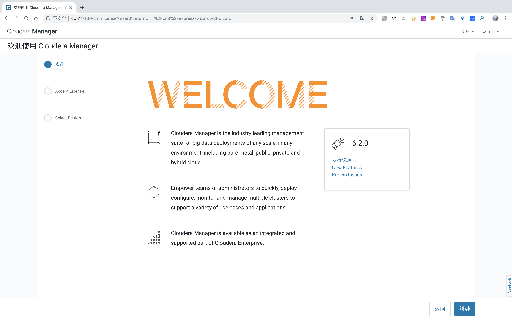


这一步选择安装的版本，不同版本支持的主要功能已列出，第一列为Cloudera免费的快速体验版；第二列为Cloudera为企业级试用版（免费试用60天）；第三列是功能和服务最全的Cloudera企业版，是需要认证且收费的。
Cloudera Express 和 Cloudera Enterprise 中的[可用功能的完整列表](https://www.cloudera.com/content/dam/www/marketing/resources/datasheets/cloudera-enterprise-datasheet.pdf.landing.html)。

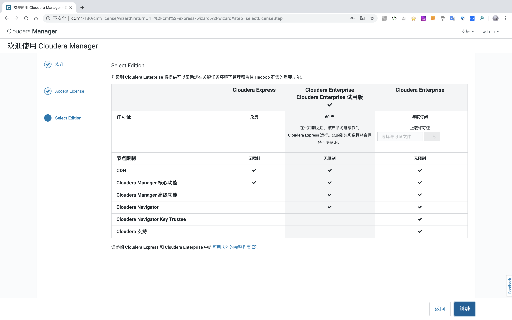

选择第一列，快速体验版服务，完全免费，功能和服务对于需求不是很特殊和复杂的试用基本没什么问题，如果后期功能不够，或满足不了需求，想使用Cloudera的企业版也不用担心，
在`Cloudera Manager`页面，点击页面头部的`管理`菜单，在下拉列表中单机`许可证`，可在页面上选择：<kbd>试用Cloudera Enterprise 60天</kbd> 、<kbd>升级至Cloudera Enterprise</kbd> ，
更详细的升级说明可查看 [从Cloudera Express升级到Cloudera Enterprise](https://www.cloudera.com/documentation/enterprise/6/6.2/topics/cm_ag_licenses.html#cmug_topic_13_7__section_p2c_5xy_qm)

选择第二列，可以直接免费体验`Cloudera Enterprise`全部功能60天，且这个每次只能试用一次，关于许可证到期或试用许可证的说明可访问 
[Managing Licenses ➹](https://www.cloudera.com/documentation/enterprise/6/6.2/topics/cm_ag_licenses.html#cmug_topic_13_7__section_ed1_nz1_wr)

选择第三列，使用**Cloudera企业版**，需要获取许可证，要获得Cloudera Enterprise许可证，请填写此[表单](https://www.cloudera.com/contact-sales.html)或致电**866-843-7207**。关于许可证的详细说明可以访问
[Managing Licenses](https://www.cloudera.com/documentation/enterprise/6/6.2/topics/cm_ag_licenses.html#cmug_topic_13_7)。其功能和价格可参考 [功能和价格](https://www.cloudera.com/products/pricing/product-features.html) 页面。


<br/><br/>


#### 集群安装


* **欢迎**
* **Cluster Basics**：给集群设置一个名字。
* **Specify Hosts**：输入集群的主机名，多个换行添加，例如：
    ```
    cdh1.ygbx.com
    cdh2.ygbx.com
    cdh3.ygbx.com
    ```
* **选择存储库**：可以设置自定义存储库（即安装的`http://cdh6/cloudera-repos/cm6/6.2.0`），等。
* **JDK 安装选项**：如果环境已经安装了，则不用勾选，直接继续。
* **提供 SSH 登录凭据**：输入Cloudera Manager主机的账号，用root，输入密码。
* **Install Agents**：
* **Install Parcels**：这里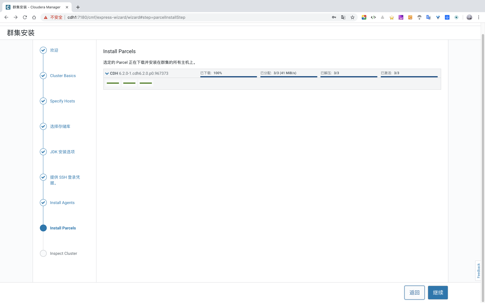
* **Inspect Cluster**：点击检查NetWork和Host，然后继续。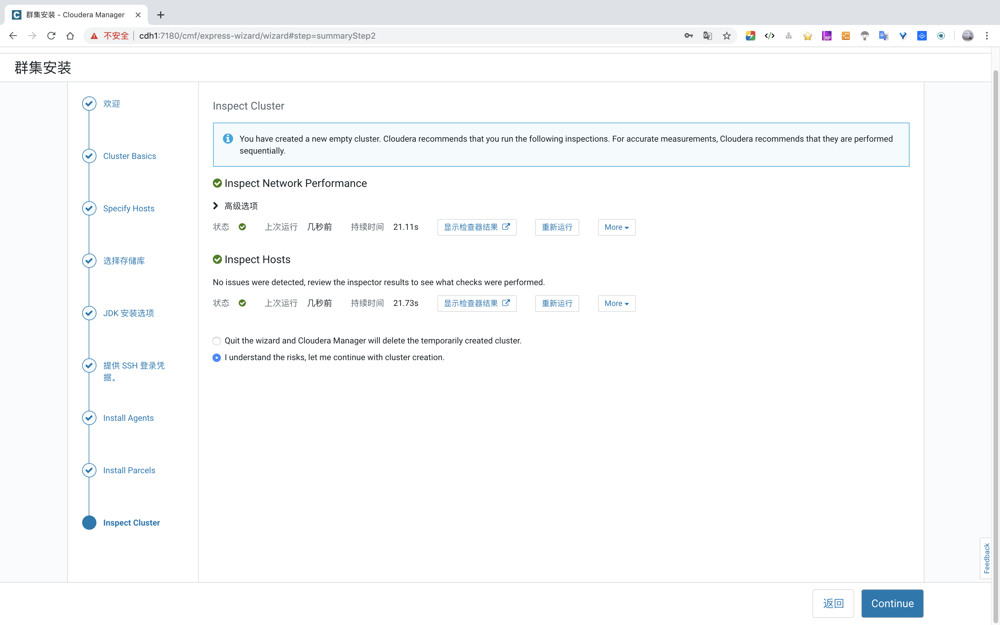

#### 使用向导设置群集

* **Select Services**：这里可以先选择基本服务`Essentials`，后期再添加服务。
* **自定义角色分配**：对选取的组建进行分配。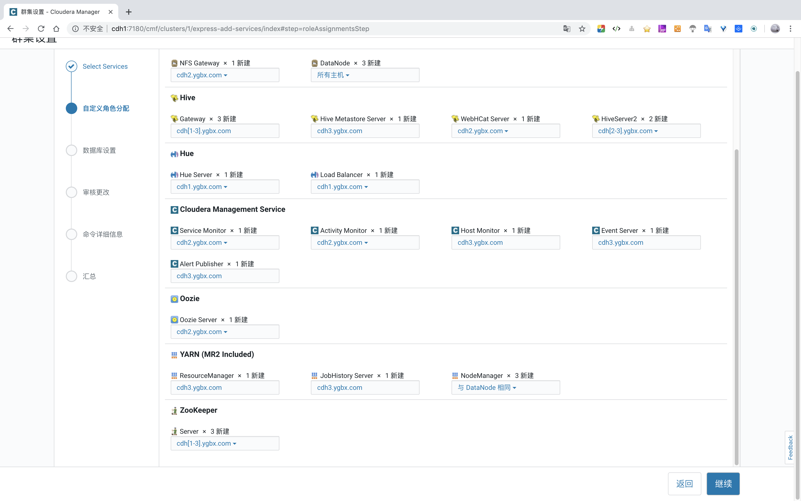
* **数据库设置**：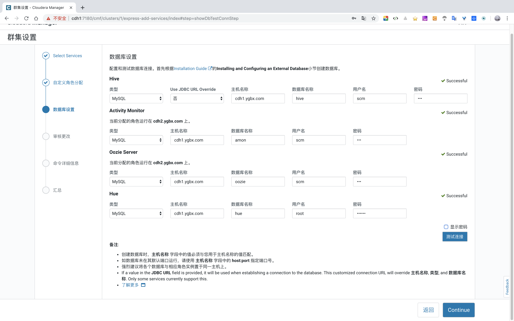
* **审核更改**：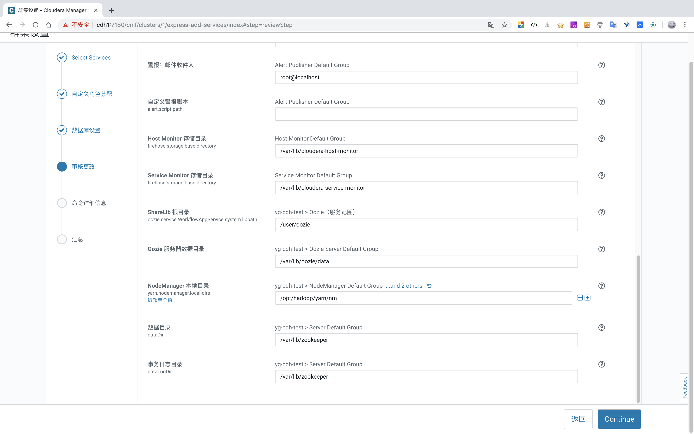
* **命令详细信息**：这一步如果是数据库的问题，就把对应的库删除，重新创建。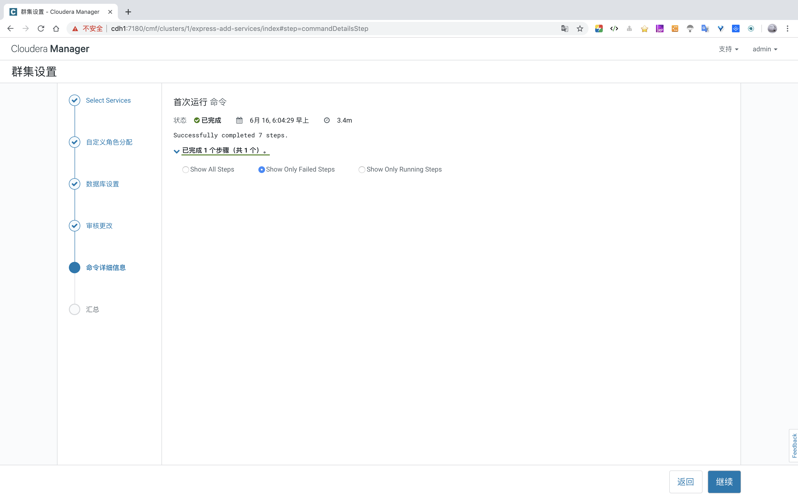
* **汇总**：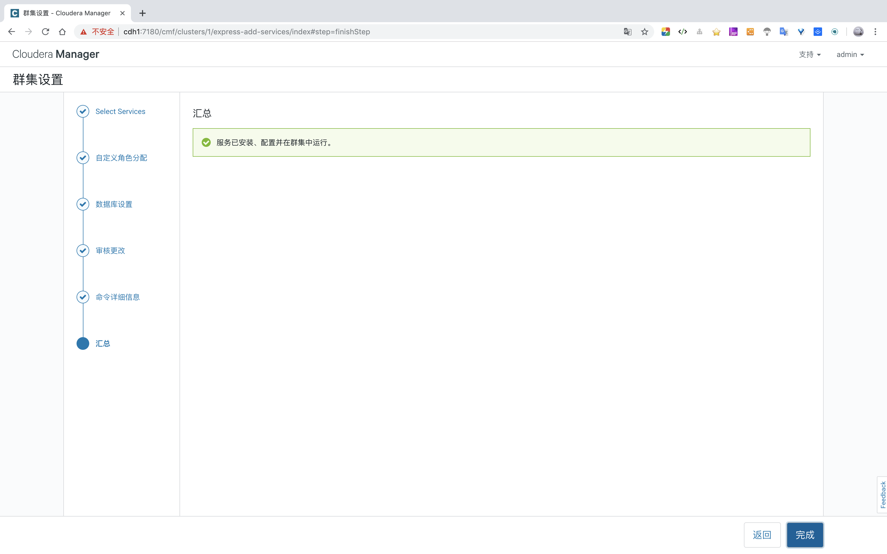


# 4. 其他问题
## 4.1 Error starting NodeManager
发生如下异常：
```
2019-06-16 12:19:25,932 WARN org.apache.hadoop.service.AbstractService: When stopping the service NodeManager : java.lang.NullPointerException
java.lang.NullPointerException
	at org.apache.hadoop.yarn.server.nodemanager.NodeManager.serviceStop(NodeManager.java:483)
	at org.apache.hadoop.service.AbstractService.stop(AbstractService.java:222)
	at org.apache.hadoop.service.ServiceOperations.stop(ServiceOperations.java:54)
	at org.apache.hadoop.service.ServiceOperations.stopQuietly(ServiceOperations.java:104)
	at org.apache.hadoop.service.AbstractService.init(AbstractService.java:172)
	at org.apache.hadoop.yarn.server.nodemanager.NodeManager.initAndStartNodeManager(NodeManager.java:869)
	at org.apache.hadoop.yarn.server.nodemanager.NodeManager.main(NodeManager.java:942)
2019-06-16 12:19:25,932 ERROR org.apache.hadoop.yarn.server.nodemanager.NodeManager: Error starting NodeManager
org.apache.hadoop.service.ServiceStateException: org.fusesource.leveldbjni.internal.NativeDB$DBException: IO error: /var/lib/hadoop-yarn/yarn-nm-recovery/yarn-nm-state/LOCK: Permission denied
	at org.apache.hadoop.service.ServiceStateException.convert(ServiceStateException.java:105)
	at org.apache.hadoop.service.AbstractService.init(AbstractService.java:173)
	at org.apache.hadoop.yarn.server.nodemanager.NodeManager.initAndStartRecoveryStore(NodeManager.java:281)
	at org.apache.hadoop.yarn.server.nodemanager.NodeManager.serviceInit(NodeManager.java:354)
	at org.apache.hadoop.service.AbstractService.init(AbstractService.java:164)
	at org.apache.hadoop.yarn.server.nodemanager.NodeManager.initAndStartNodeManager(NodeManager.java:869)
	at org.apache.hadoop.yarn.server.nodemanager.NodeManager.main(NodeManager.java:942)
Caused by: org.fusesource.leveldbjni.internal.NativeDB$DBException: IO error: /var/lib/hadoop-yarn/yarn-nm-recovery/yarn-nm-state/LOCK: Permission denied
	at org.fusesource.leveldbjni.internal.NativeDB.checkStatus(NativeDB.java:200)
	at org.fusesource.leveldbjni.internal.NativeDB.open(NativeDB.java:218)
	at org.fusesource.leveldbjni.JniDBFactory.open(JniDBFactory.java:168)
	at org.apache.hadoop.yarn.server.nodemanager.recovery.NMLeveldbStateStoreService.openDatabase(NMLeveldbStateStoreService.java:1517)
	at org.apache.hadoop.yarn.server.nodemanager.recovery.NMLeveldbStateStoreService.initStorage(NMLeveldbStateStoreService.java:1504)
	at org.apache.hadoop.yarn.server.nodemanager.recovery.NMStateStoreService.serviceInit(NMStateStoreService.java:342)
	at org.apache.hadoop.service.AbstractService.init(AbstractService.java:164)
	... 5 more
```
查看每个`NodeManager`节点的`/var/lib`
```bash
cd /var/lib
ls -l | grep -i hadoop
```
发现有一个节点信息如下：
```
[root@cdh1 lib]#  ls -l | grep -i hadoop
drwxr-xr-x   3          996          992 4096 Apr 25 14:39 hadoop-hdfs
drwxr-xr-x   2 cloudera-scm cloudera-scm 4096 Apr 25 13:50 hadoop-httpfs
drwxr-xr-x   2 sentry       sentry       4096 Apr 25 13:50 hadoop-kms
drwxr-xr-x   2 flume        flume        4096 Apr 25 13:50 hadoop-mapreduce
drwxr-xr-x   4 solr         solr         4096 Apr 25 14:40 hadoop-yarn
```
而其他节点为：
```
[root@cdh2 lib]#  ls -l | grep -i hadoop
drwxr-xr-x  3 hdfs         hdfs         4096 Jun 16 06:04 hadoop-hdfs
drwxr-xr-x  3 httpfs       httpfs       4096 Jun 16 06:04 hadoop-httpfs
drwxr-xr-x  2 mapred       mapred       4096 Jun 16 05:06 hadoop-mapreduce
drwxr-xr-x  4 yarn         yarn         4096 Jun 16 06:07 hadoop-yarn
```
所以执行如下，修改有问题的那个节点对应文件的归属和权限。重启有问题的节点的`NodeManager`
```bash
chown  -R hdfs:hdfs /var/lib/hadoop-hdfs
chown  -R httpfs.httpfs /var/lib/hadoop-httpfs
chown  -R kms.kms /var/lib/hadoop-kms
chown  -R mapred:mapred /var/lib/hadoop-mapreduce
chown  -R yarn:yarn /var/lib/hadoop-yarn
chmod -R 755 /var/lib/hadoop-*
```

## 4.2 Could not open file in log_dir /var/log/catalogd: Permission denied
查看日志如下异常信息：
```
+ exec /opt/cloudera/parcels/CDH-6.2.0-1.cdh6.2.0.p0.967373/lib/impala/../../bin/catalogd --flagfile=/var/run/cloudera-scm-agent/process/173-impala-CATALOGSERVER/impala-conf/catalogserver_flags
Could not open file in log_dir /var/log/catalogd: Permission denied

……

+ exec /opt/cloudera/parcels/CDH-6.2.0-1.cdh6.2.0.p0.967373/lib/impala/../../bin/statestored --flagfile=/var/run/cloudera-scm-agent/process/175-impala-STATESTORE/impala-conf/state_store_flags
Could not open file in log_dir /var/log/statestore: Permission denied
```
以执行如下，修改有问题的那个节点对应文件的归属和权限。重启有问题的节点的对应的服务
```bash
cd /var/log
ls -l /var/log | grep -i catalogd
# 在`Imapala Catalog Server`节点执行
chown  -R impala:impala /var/log/catalogd
# 在`Imapala StateStore`节点
chown  -R impala:impala /var/log/statestore
```


## 4.3 Cannot connect to port 2049
```
CONF_DIR=/var/run/cloudera-scm-agent/process/137-hdfs-NFSGATEWAY
CMF_CONF_DIR=
unlimited
Cannot connect to port 2049.
using /opt/cloudera/parcels/CDH-6.2.0-1.cdh6.2.0.p0.967373/lib/bigtop-utils as JSVC_HOME
```
在`NFS Gateway`节点启动`rpcbind`
```bash
# 查看各节点的 NFS服务状态
 systemctl status nfs-server.service
# 如果没有就安装
 yum -y install nfs-utils 
 
# 查看 rpcbind 服务状态
 systemctl status rpcbind.service
# 如果没有启动，则启动 rpcbind
 systemctl start rpcbind.service
```

## 4.4 Kafka不能创建Topic
当我们将Kafka组件安装成功之后，我们创建一个Topic，发现创建失败：
```
[root@cdh2 lib]# kafka-topics.sh --create --zookeeper localhost:2181 --replication-factor 1 --partitions 1 --topic canal
Error while executing topic command : Replication factor: 1 larger than available brokers: 0.
19/06/16 23:27:30 ERROR admin.TopicCommand$: org.apache.kafka.common.errors.InvalidReplicationFactorException: Replication factor: 1 larger than available brokers: 0.
```
此时可以登陆`zkCli.sh` 查看Kafka的zNode信息，发现一切正常，ids都在，后台程序创建的Topic Name也在，但就是无法用命令查看。

**此时可以先将Zookeeper和Kafka都重启一下，再尝试，如果依旧不行，将Kafka在Zookeeper的zNode目录设置为根节点**。然后重启，再次创建和查看，发现现在Kafka正常了。

## 4.5 安装Hive组件异常
查看日志如果提示metastore获取VERSION失败，可以查看Hive的元数据库`hive`库下是否有元数据表，如果没有，手动将表初始化到Mysql的hive库下：
```
# 查找Hive元数据初始化的sql脚本，会发现搜到了各种版本的sql脚本
find / -name hive-schema*mysql.sql
# 例如可以得到：/opt/cloudera/parcels/CDH-6.2.0-1.cdh6.2.0.p0.967373/lib/hive/scripts/metastore/upgrade/mysql/hive-schema-2.1.1.mysql.sql

# 登陆Mysql数据库
mysql -u root -p
> use hive;
> source /opt/cloudera/parcels/CDH-6.2.0-1.cdh6.2.0.p0.967373/lib/hive/scripts/metastore/upgrade/mysql/hive-schema-2.1.1.mysql.sql
```
这一步就初始化了Hive的元数据表，然后重启Hive实例的服务。


## 4.6 Impala时区问题设置
Impala不进行设置，获取的日期类型的数据时区是有八个小时的时差，因此最好设置一下。

<kbd>Cloudera Manager Web页面</kbd> &nbsp;>&nbsp;  <kbd>Impala</kbd>  &nbsp;>&nbsp;  <kbd>配置</kbd>  &nbsp;>&nbsp;  <kbd>
搜索：`Impala Daemon 命令行参数高级配置代码段（安全阀）`</kbd>  &nbsp;>&nbsp;  <kbd>添加 `-use_local_tz_for_unix_timestamp_conversions=true`</kbd> 

保存配置，并重启Impala。


## 4.7 hdfs用户登录不上
当hdfs开启权限认证时，切换到hdfs对数据进行操作是：
```bash
[root@cdh1 ~]# su hdfs
This account is currently not available.
```
此时查看系统的用户信息，将`hdfs` 的`/sbin/nologin`改为`/bin/bash`，然后保存，再次登录hdfs即可。
```
[root@cdh1 ~]# cat /etc/passwd | grep hdfs
hdfs:x:954:961:Hadoop HDFS:/var/lib/hadoop-hdfs:/sbin/nologin

#将上面的信息改为如下
 hdfs:x:954:961:Hadoop HDFS:/var/lib/hadoop-hdfs:/bin/bash
```

## 4.8 NTP问题
查看角色日志详细信息发现：
```
Check failed: _s.ok() Bad status: Runtime error: Cannot initialize clock: failed to wait for clock sync using command '/usr/bin/chronyc waitsync 60 0 0 1': /usr/bin/chronyc: process exited with non-zero status 1
```
在服务器上运行` ntptime` 命令的信息如下，说明NTP存在问题
```
[root@cdh3 ~]# ntptime
ntp_gettime() returns code 5 (ERROR)
  time e0b2b833.5be28000  Tue, Jun 18 2019  9:09:07.358, (.358925),
  maximum error 16000000 us, estimated error 16000000 us, TAI offset 0
ntp_adjtime() returns code 5 (ERROR)
  modes 0x0 (),
  offset 0.000 us, frequency 9.655 ppm, interval 1 s,
  maximum error 16000000 us, estimated error 16000000 us,
  status 0x40 (UNSYNC),
  time constant 10, precision 1.000 us, tolerance 500 ppm,
```
特别要注意一下输出中的重要部分（us - 微妙）：
* `maximum error 16000000 us`：这个时间误差为16s，已经高于Kudu要求的最大误差
* `status 0x40 (UNSYNC)`：同步状态，此时时间已经不同步了；如果为`status 0x2001 (PLL,NANO)`时则为健康状态。

正常的信息如下：
```
[root@cdh1 ~]# ntptime
ntp_gettime() returns code 0 (OK)
  time e0b2b842.b180f51c  Tue, Jun 18 2019  9:09:22.693, (.693374110),
  maximum error 27426 us, estimated error 0 us, TAI offset 0
ntp_adjtime() returns code 0 (OK)
  modes 0x0 (),
  offset 0.000 us, frequency 3.932 ppm, interval 1 s,
  maximum error 27426 us, estimated error 0 us,
  status 0x2001 (PLL,NANO),
  time constant 6, precision 0.001 us, tolerance 500 ppm,
```

如果是`UNSYNC`状态，请查看服务器的NTP服务状态：`systemctl  status  ntpd.service`，如果没有配置NTP服务的请安装，然后进行配置`/etc/ntp.conf`，例如时间同步服务配置：
```
driftfile /var/lib/ntp/drift
restrict default nomodify notrap nopeer noquery
restrict 127.0.0.1 
restrict ::1
restrict localhost mask 255.255.255.0 nomodify notrap
server 127.127.1.0	 # local clock
fudge  127.127.1.0   stratum 10
includefile /etc/ntp/crypto/pw
keys /etc/ntp/keys
disable monitor
```
其他节点上配置`server ntp服务ip`。完成后启动`systemctl  start  ntpd.service`。手动同步时间`ntpdate -u ntp-server-ip`。
这部分介绍可以查看文档[NTP Clock Synchronization](https://www.cloudera.com/documentation/enterprise/5-15-x/topics/kudu_troubleshooting.html#ntp_clock_sync)，或者其他文档。


## 4.9 安装组件的其他异常
如果前面都没问题体，在安装组件最常见的失败异常，就是文件的角色和权限问题，请参照4.2方式排查和修复。多查看对应的日志，根据日志信息解决异常。


# PO一张最后安装完成的CDH Web 页面

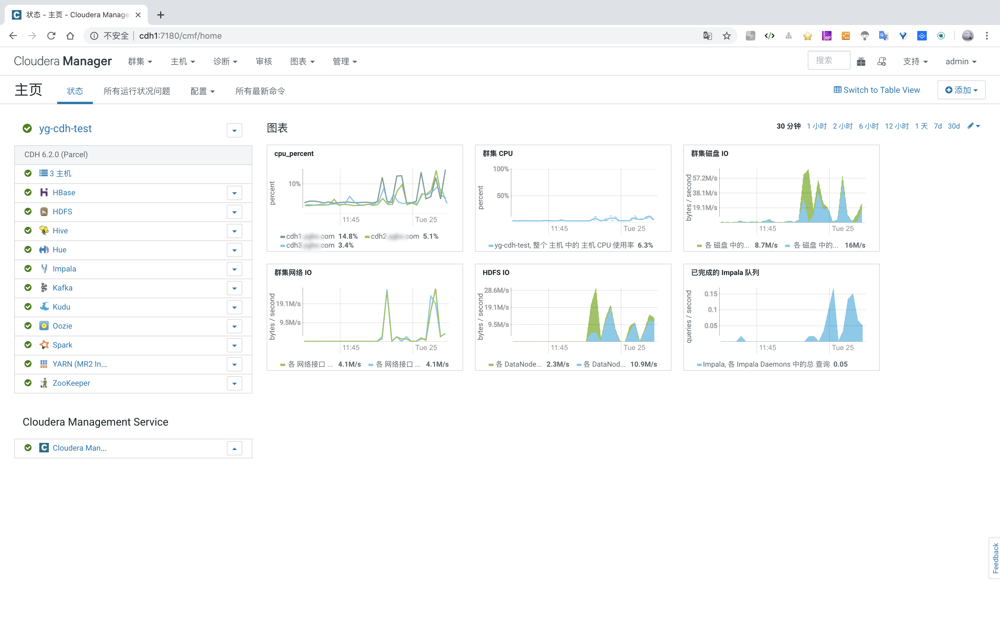


# 最后
我的博客 [CDH 6.2.0 安装实战（含官方文档资料链接）](https://blog.csdn.net/github_39577257/article/details/92471365)


```
[root@cdh3 ~]# ntptime
ntp_gettime() returns code 5 (ERROR)
  time e0b2b833.5be28000  Tue, Jun 18 2019  9:09:07.358, (.358925),
  maximum error 16000000 us, estimated error 16000000 us, TAI offset 0
ntp_adjtime() returns code 5 (ERROR)
  modes 0x0 (),
  offset 0.000 us, frequency 9.655 ppm, interval 1 s,
  maximum error 16000000 us, estimated error 16000000 us,
  status 0x40 (UNSYNC),
  time constant 10, precision 1.000 us, tolerance 500 ppm,
```
