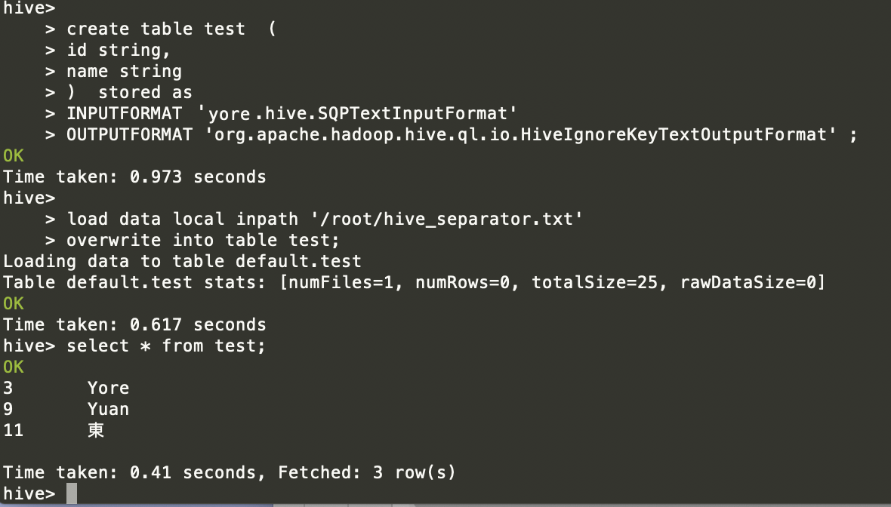

Hive自定义分割符
===
导出到HDFS或者本地的数据文件，需要直接导入Hive时，有时包含特殊字符，按照给定的字段分隔符或者默认换行分隔符，
插入到Hive的数据可能不是我们预期的。此时需要我们自定义 Hive 的分隔符。

基本原理是，Hive将HDFS上的文件导入Hive会默认调用 Hadoop(hadoop-mapreduce-client-core-2.7.7.jar包)的 `TextInputFormat`
将输入的数据进行格式化。因此我们只需自定义重写的`TextInputFormat`类，重写`TextInputFormat`类时需要在`getRecordReader`方法里重写
 `LineRecordReader`类，然后在 Hive CLI设置好编码、字段分隔符、行分隔符，最后在建表的时候指定`INPUTFORMAT`为我们自定义的`TextInputFormat`。


# Use
因为项目是一个 Maven 项目，可以直接使用 Maven 命令打包 mvn clean package。如果是在 Idea 则直接点击运行右侧的 Maven Projects --> Lifecycle --> package 

## 将程序打成jar包，放到 Hive 和 Hadoop 的lib库下
在hvie的CLI命令行界面可以设置如下参数，分别修改编码格式、自定义字段分隔符和自定义换行符。

```sql
//"US-ASCII""ISO-8859-1""UTF-8""UTF-16BE""UTF-16LE""UTF-16"  
hive> set textinputformat.record.encoding=UTF-8;
// 字段间的切分字符
hive> set textinputformat.record.fieldsep=,;
// 行切分字符
hive> set textinputformat.record.linesep=|+|; 
```
以上命令设置输入文件的编码格式为 UTF-8，字符安间的分割符为英文逗号，行分隔符为 |+| 符。

## 建表时指定 Inputformat 和 OutputFormat 
其中 `INPUTFORMAT` 为我们自定的 `TextInputFormat`类的全限定类名：[yore.hive.SQPTextInputFormat](src/main/java/yore/hive/SQPTextInputFormat.java)。
例如：
```sql
hive> create table test  (  
    >   id string,  
    >   name string  
    > )  stored as  
    > INPUTFORMAT 'yore.hive.SQPTextInputFormat'  
    > OUTPUTFORMAT 'org.apache.hadoop.hive.ql.io.HiveIgnoreKeyTextOutputFormat' ; 
```

## 测试数据
例如 在家目录下创建一个 hive_separator.txt 文件
```
[root@node1 ~]# cat hive_separator.txt
3,Yore|+|9,Yuan|+|11,東
```

## 加载数据
```sql
hive> load data local inpath '/root/hive_separator.txt' 
    > overwrite into table test;

```

## 查询数据
```sql
hive> select * from test;
OK
3       Yore
9       Yuan
11      東
```



